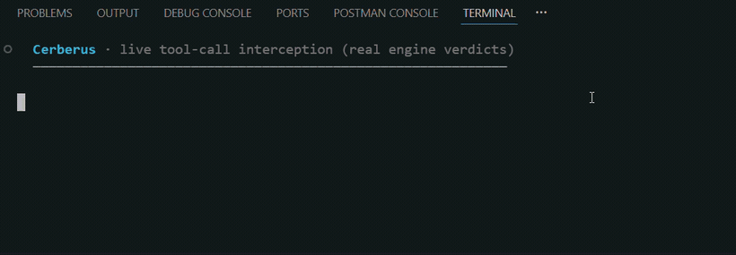

# Cerberus 🐺

[](./LICENSE)
[](https://nodejs.org)
[](https://github.com/Asati-git/ai-agent-firewall/actions/workflows/ci.yml)



A **local-first security gateway for autonomous AI coding agents.** Cerberus sits between the agent
(Claude Code, Codex, Cursor, Cline) and your machine, intercepts **every tool call** before it runs,
risk-scores it across four signals, and either **allows, audits, asks for human approval, or blocks**
it — all on your machine, with **no external API and nothing leaving the box.**

## Setup & usage
Cerberus isn't on npm yet — you install it **from source**. It runs on **Windows, macOS, and Linux**
(the Cline adapter is macOS/Linux only; Claude Code / Codex / Cursor work everywhere).

**Prerequisites:** [Node.js **≥ 20**](https://nodejs.org) (check with `node -v`), plus `git` and `npm`
(bundled with Node). No account, API key, or network service — everything runs locally on `127.0.0.1`.

### 1 · Clone & install
```bash
git clone https://github.com/Asati-git/ai-agent-firewall.git
cd ai-agent-firewall

npm install          # ⚠️ REQUIRED — nothing runs until this finishes
```
> **This is the step people skip.** Any `node bin/cerberus.mjs …` command run *before* `npm install`
> stops with *"dependencies are missing"* (older builds: `Cannot find package 'tsx'`). The fix is always
> the same — run `npm install` in the project folder first.

Confirm the install with a command that writes nothing and holds no port:
```bash
node bin/cerberus.mjs rules validate      # → "All rule files valid."
```

Two optional conveniences:
```bash
npm run build:engine     # compile to dist/ → faster startup (otherwise it runs the TS source via tsx)
npm link                 # lets you type `cerberus …` instead of `node bin/cerberus.mjs …`
```
> Commands below are shown as `node bin/cerberus.mjs …` (always works). After `npm link` you can use the
> shorter `cerberus …`. On Windows `npm link` may need an admin terminal / Developer Mode — if it complains,
> just skip it and keep the `node bin/…` form.

### 2 · Wire the hook into your agent
```bash
node bin/cerberus.mjs init             # Claude Code, THIS project only  (writes ./.claude/settings.json)
node bin/cerberus.mjs init --global    # …or every project on this machine (~/.claude/settings.json)

# other agents:   --agent codex | cursor | cline
# preview the exact config without writing anything:   --print
```
`init` **merges** into your agent's config (never overwrites), is **idempotent**, and **backs up** the
existing file to `<path>.bak` first. On success it prints `✅ Wired Cerberus into claude at <path>`.
To undo later: delete the added hook block, or restore the `.bak`.

### 3 · Start the gateway — and keep it running
```bash
node bin/cerberus.mjs engine           # binds 127.0.0.1:9000 (loopback only), stays in the foreground
```
Leave this terminal open: the hook talks to this process on **every** tool call. For convenience you can
instead **double-click `start-engine.bat`** (Windows) or **`start-engine.command`** (macOS/Linux — `chmod +x`
it once). Port 9000 already in use? `CB_ENGINE_PORT=9001 node bin/cerberus.mjs engine` (set the same var
wherever the agent runs).

### 4 · Use your agent as normal
Tool calls now route through Cerberus. **Risky** ones (`rm -rf`, reading `~/.ssh`, a leaked `.env`, an odd
network egress) surface your agent's **native approve/deny prompt** with Cerberus's reason; safe calls
pass silently.
> If the engine **isn't** running, calls are **blocked by default** (fail-closed — a firewall that fails
> silently open is worse than none). Set `CB_FAIL_OPEN=1` to allow calls through while it's down instead.

### 5 · Verify it's actually working
```bash
# a) engine alive?
curl http://127.0.0.1:9000/health
#    → {"ok":true,"pending":0}

# b) the "brain" decides correctly — these only ASK for a verdict; NOTHING is executed:
curl -s -X POST http://127.0.0.1:9000/intercept -H "content-type: application/json" \
  -d '{"tool":"Read","input":{"file_path":"README.md"}}'      #  → "action":"ALLOW"
curl -s -X POST http://127.0.0.1:9000/intercept -H "content-type: application/json" \
  -d '{"tool":"Bash","input":{"command":"rm -rf /"}}'         #  → "action":"BLOCK"
```
- **Hook wired?** `init` printed `✅ Wired…`, or your `.claude/settings.json` contains a hook whose command includes `cerberus.mjs`.
- **End-to-end:** with the engine running, ask your agent to do something risky → you'll see the approval prompt (or a block).

### Optional · forensic dashboard UI
The gateway enforces fine without it, but for the session timeline / risk-replay UI at
`http://127.0.0.1:9000/`, build the dashboard once (it's a **separate** npm project, so it needs its own
install):
```bash
npm --prefix dashboard install && npm run build
```
Restart the engine afterwards. Until it's built, `http://127.0.0.1:9000/` returns `{"error":"not found"}`
(the API and enforcement still work).

### Optional · defense beyond the tool boundary
```bash
node bin/cerberus.mjs scan           # scan MCP tools for poisoning / rug-pulls
node bin/cerberus.mjs deps           # audit lockfiles for known-bad / vulnerable packages
node bin/cerberus.mjs proxy --mitm   # network egress gate: redact secrets from the outbound LLM prompt
node bin/cerberus.mjs feeds refresh  # refresh the offline malicious-domain feed
```

### Troubleshooting
| Symptom | Cause → fix |
|---|---|
| `Cannot find package 'tsx'` / *"dependencies are missing"* | `npm install` was skipped → run it in the project folder |
| Every tool call blocked: *"engine unreachable … Failing closed"* | engine not running → start `node bin/cerberus.mjs engine` (or `CB_FAIL_OPEN=1` to allow while it's down) |
| `http://127.0.0.1:9000/` shows `{"error":"not found"}` | dashboard not built → `npm --prefix dashboard install && npm run build`, then restart the engine |
| `EADDRINUSE` on startup | port 9000 in use → `CB_ENGINE_PORT=9001 …` (set the same var for the agent) |
| Codex / Cline never prompt for held calls | no native prompt → run engine with `CB_APPROVAL_SURFACE=dashboard`, approve via `cerberus pending` |
| `proxy --mitm`: *"requires node-forge"* | optional dep skipped → `npm i node-forge` |

## The problem
Autonomous coding agents run shell commands, edit files, and make network calls on your behalf — at
machine speed, often unattended. One bad step (`rm -rf`, an unwanted `git push`, a leaked `.env`, a
poisoned README that tricks the agent into exfiltrating secrets) and there's no human in the loop to
stop it. Cerberus puts that checkpoint **on the tool boundary**, where the agent actually acts.

## What it does
```
PreToolUse  ─▶ intercept ─▶ Policy + Behavioral + Content + Injection ─▶ Risk Engine ─▶ ALLOW · AUDIT · HITL · BLOCK
PostToolUse ─▶ inspect   ─▶ secret + injection detection ─▶ session contamination state
```
Four deterministic signals aggregated into one weighted risk score, with a hard floor that absolute
prohibitions can never override.

## What it protects against
- **🟢 Secret exfiltration** — detects secrets loaded into context, then **content-matches the outbound
  payload**: holds the call that actually carries the key (raw or base64/hex/url-encoded), with provenance
  (`source: .env:4 · sha256:… · 97%`) and never logging the secret itself.
- **🟢 Excessive permissions** — every call gated; unknown tools fail-closed; sensitive paths (`~/.ssh`,
  `~/.aws`, credentials, `/etc/passwd`) held; destructive commands (`rm -rf`, `Remove-Item -Recurse`,
  `chmod 777`, `kill -9`) blocked or held.
- **🟢 Dangerous egress** — destination policy: trusted hosts (registries, GitHub, OpenAI/Anthropic)
  auto-allowed; paste sites / webhook catchers / raw-IP destinations held.
- **🟡 Tool abuse** — runaway-loop and tool-call-rate/repetition detection.
- **🟡 Prompt injection** — detects injection in tool *results* and gates the next egress (heuristic
  classifier; optional local DeBERTa model). It sees tool calls, **not the LLM prompt** — so it catches the
  *exploitation* of an injection (the egress), not the injection itself.

## Key features
- **Terminal-first approval** — held calls surface in the agent's native permission prompt (Claude Code /
  Cursor), or via `cerberus approve <id>` / a localhost dashboard.
- **Forensic dashboard** — per-session timeline, risk-factor breakdown, and a **Replay** player that steps
  through how a session's risk built up.
- **Multi-agent** — one adapter layer serves Claude Code, Codex, Cursor, and Cline.
- **Policy as data** — rules and risk weights are editable YAML, not code.
- **Local-first** — binds to `127.0.0.1`, no external API, no telemetry; secret *values* never touch disk or logs.

## Quickstart

```bash
# install from source (see "Setup & usage" above — npm publish pending), then, e.g. after `npm link`:

# wire Cerberus into your agent (merges into the agent's config — backed up, idempotent):
cerberus init                 # Claude Code, project-level   (--agent codex|cursor|cline, --global, --print)

# start the gateway + dashboard (one process):
cerberus engine               # then open http://127.0.0.1:9000/
```

Use your agent as usual — tool calls now route through Cerberus. By default a held (HITL) call is
**approved right in the terminal**: Cerberus returns `ask`, so Claude Code shows its native
permission prompt with Cerberus's reason — approve/deny without leaving your session.

The dashboard (`http://127.0.0.1:9000/`) has a **Live** tab (Action Center + stream) and a
**Sessions** tab — a forensic timeline per session with a risk-factor breakdown and a **Replay**
player to step through how a session's risk built up.

## Beyond the tool boundary (defense in depth)
Several commands extend Cerberus past the PreToolUse hook:

```bash
# 1. Scan MCP tool definitions for POISONING + rug-pull (tool-pinning). Auto-discovers your MCP
#    servers from the agent configs and pulls each one's live tools/list:
cerberus scan                            # flags hidden-unicode / injection / exfil directives in
cerberus scan --pin                      # tool descriptions, and detects a tool whose definition
cerberus scan --file tools.json          # silently CHANGED since you pinned it (a "rug pull").
cerberus scan --no-connect               # (or scan a hand-captured tools/list dump / just list servers)

# 2. Supply-chain audit of your lockfiles (OFFLINE): known-malicious/vulnerable packages, URL/git
#    deps (postinstall RCE surface), and a hash-pin (tamper-evidence) audit:
cerberus deps                            # (--osv also queries OSV.dev online, opt-in)
cerberus feeds refresh                   # refresh the local IOC destination feed (offline match at runtime)

# 3. Egress proxy — a NETWORK-layer gate outside the agent's trust boundary. Every outbound
#    connection is decided by the same engine (destination policy + secret-in-body matching):
cerberus proxy                           # then: export HTTPS_PROXY=http://127.0.0.1:9100
cerberus proxy --mitm                    # + terminate TLS: scan HTTPS RESPONSE bodies for injected
                                         #   payloads AND redact secrets from the OUTBOUND prompt to
                                         #   LLM providers (needs node-forge + trusting .cerberus/ca.crt)
```
The hook runs *inside* the agent; the proxy runs *outside* it, so a fully-owned agent can't route
around the destination policy. By default HTTPS is gated by destination host and plain HTTP is
body-scanned; **`--mitm`** decrypts HTTPS to (a) scan the response body (the "malicious router injected a
payload" vector) and (b) **redact structured secrets from the outbound prompt** before the model/router
sees them (defeats router key-harvesting; `CB_REDACT=0` to disable). A **credential guard** blocks an API
key sent over plaintext or to a non-provider host, and a curated blocklist **blocks known-compromised
package installs + IOC endpoints**.

## Terminal-first approvals
Cerberus runs *inside* the agent's execution loop, so the terminal is the realtime decision point
and the dashboard is the deep dive. Per severity (default `CB_APPROVAL_SURFACE=terminal`):

| verdict | terminal | web UI |
|---|---|---|
| **BLOCK** | ⛔ denied in-terminal (Claude shows the reason) + optional auto-open | forensics |
| **HITL** | ✋ **Claude's native permission prompt**, with Cerberus's reason | forensics |
| **AUDIT** | — (quiet) | elevated-risk record |
| **ALLOW** | — (silent) | — |

Prefer a central web queue instead? Set **`CB_APPROVAL_SURFACE=dashboard`** — held calls then pause on
the engine's synchronous hold and you Approve/Deny from the dashboard (or the terminal, out-of-band):

```bash
cerberus pending              # list calls held for review (with their ids)
cerberus approve <id>         # release a held call …
cerberus deny <id>            # … or deny it
```

Extra terminal alerts write to the controlling terminal (`/dev/tty`, falling back to stderr) so the
protocol channel to Claude Code stays clean. Tune via env:

| env | default | effect |
|---|---|---|
| `CB_NOTIFY` | `1` | extra terminal alert lines on/off (`0` to silence) |
| `CB_APPROVAL_SURFACE` | `terminal` | `terminal` ⇒ HITL via Claude's native prompt; `dashboard` ⇒ socket hold + dashboard approve |
| `CB_AUTO_OPEN` | `off` | `block` ⇒ auto-open the investigation UI on a BLOCK/EXFIL |

## Agents
The engine + signals + risk + dashboard are agent-agnostic; only a thin **adapter** (parse the agent's
hook event → normalize → emit its verdict shape) is per-agent. Wire one with `cerberus init --agent <name>`:

| agent | `--agent` | HITL approval | notes |
|---|---|---|---|
| **Claude Code** | `claude` (default) | native terminal prompt (`ask`) | verified end-to-end |
| **Codex CLI** | `codex` | dashboard hold (no native ask) — `CB_APPROVAL_SURFACE=dashboard` | enterprise `requirements.toml` makes it non-bypassable |
| **Cursor** | `cursor` | native IDE prompt (`ask`) | init sets `failClosed: true` |
| **Cline** | `cline` | dashboard hold (`cancel` bool) | macOS/Linux only |

`codex`/`cursor`/`cline` adapters follow the published hook specs; verify against your installed version
(`cerberus init --agent <name> --print` shows the exact config). Roo Code is unsupported (archived 2026).

## How it plugs in
- **PreToolUse hook → `/intercept`** is the single hard enforcement point (allow/deny/ask; or HITL holds the
  socket open until you decide).
- **PostToolUse hook → `/inspect`** is observe-only: it updates the session's contamination state so
  the *next* action is judged with full context. It never modifies a tool result.
- The engine is **agent-agnostic** at its core; per-agent adapters (`--agent`) are the only thing that differs.

## Architecture
```
PreToolUse  ─▶ /intercept ─▶ Policy + Behavioral + Content/Injection ─▶ RiskEngine ─▶ ALLOW/AUDIT/HITL/BLOCK
PostToolUse ─▶ /inspect   ─▶ secret detection + injection classifier ─▶ session contamination state
                                                                   (audit log + WebSocket → dashboard)
```
Single Node + TypeScript package; the dashboard is a Vite/React app served by the engine. Rules and
risk weights are editable **YAML data**, not code (`rules/`).

## What it is — and isn't
Cerberus is a **runtime gateway on the tool boundary**. It's strongest at secret-exfiltration
prevention and as a permission chokepoint. Because it sees tool calls (not the LLM prompt), it catches
the *exploitation* of a prompt injection — not the injection itself — and it does **not** cover
data-pipeline / RAG poisoning. The exfil match is high-confidence but not airtight (novel secret formats,
split-across-calls encoding). Honest defaults over false guarantees.

## Local-first & licensing
No external API, no API key, nothing leaves the machine. The optional injection model
([`@cerberussec/injection-model`](packages/injection-model), ProtectAI DeBERTa, Apache-2.0) upgrades
the built-in heuristic classifier; install it only if you want it. The core is OSS-clean
(Apache/MIT-compatible deps); Meta Prompt-Guard is deliberately kept out of core (Llama license).

**Attribution.** This is a maintained, extended fork of
[Adirdabush1/cerberus](https://github.com/Adirdabush1/cerberus) (Apache-2.0, © 2026 Adir Dabush).
Downstream additions (MCP poisoning/rug-pull scan, egress proxy + MITM + prompt-secret redaction,
supply-chain deps audit, offline IOC feed, command-chaining de-obfuscation hardening) are documented in
[`NOTICE`](./NOTICE). Licensed under the Apache License, Version 2.0 — see [`LICENSE`](./LICENSE).

## Development
```bash
# from a clone: install (root + dashboard are separate npm projects) and build
npm install && npm --prefix dashboard install
npm run build             # compile the engine (tsc → dist) + dashboard (vite → dashboard/dist)

npm run engine            # run from source via tsx (dev)
npm run typecheck
# the full suite (20 unit suites + 5 e2e + attack/redteam/malware sims) — see .github/workflows/ci.yml
# as the source of truth. e.g. the new-module suites:
npm run test:policy && npm run test:bypass && npm run test:mcp-scan && npm run test:proxy \
  && npm run test:mitm && npm run test:deps && npm run test:ioc && npm run test:hook && npm run test:store
npm run e2e:ioc && npm run e2e:attack && npm run e2e:redteam && npm run e2e:malware
```
See `PLAN.md` for milestones and `brainstorms/` for the design records behind each decision.
